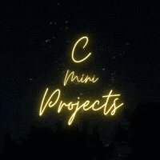

<p align="center">
  <a href="" rel="noopener">
 </a>
</p>

<h3 align="center">C Mini Projects</h3>

<div align="center">

[]()
[](https://github.com/VinayKanase/C-Mini-Projects/issues)
[](https://github.com/VinayKanase/C-Mini-Projects/pulls)
[](/LICENSE)

</div>

---

<p align="center"> Amazing Repository with mini C Projects.
    <br> 
You Can Learn and Practice C with these Projects.
</p>

## 📝 Table of Contents

- [About](#about)
- [Getting Started](#getting_started)
- [Built Using](#built_using)
- [TODO](./TODO.md)
- [Authors](#authors)
- [Acknowledgments](#acknowledgement)

## 🧐 About <a name = "about"></a>

C is most basic programming language. In Engineering this is the first language we learn. I will be sharing some of the mini projects I build with C.

I also have some basic codes in [C Notes Repository](https://github.com/VinayKanase/C-Notes).

## 🏁 Getting Started <a name = "getting_started"></a>

These instructions will get you a copy of the project up and running on your local machine for development and testing purposes.

### Prerequisites

Git installed on your local machine.
C Compiler for compiling C Code files.

### Installing

```bash
git clone git@github.com:VinayKanase/C-Mini-Projects.git
```

or frok this repository.

## ⛏️ Built Using <a name = "built_using"></a>

- [C](<https://en.wikipedia.org/wiki/C_(programming_language)>) - programming language

## ✍️ Authors <a name = "authors"></a>

- [@Vinay](https://github.com/VinayKanase)

See also the list of [contributors](https://github.com/VinayKanase/C-Mini-Projects/graphs/contributors) who participated in this project.

## 🎉 Acknowledgements <a name = "acknowledgement"></a>

- Hat tip to anyone whose code was used
- Inspiration
  - [50+ C Projects](https://learnprogramo.com/50-interesting-programming-c-projects-download-with-source-code/)
- References
  - [C Notes Repository](https://github.com/VinayKanase/C-Notes)
